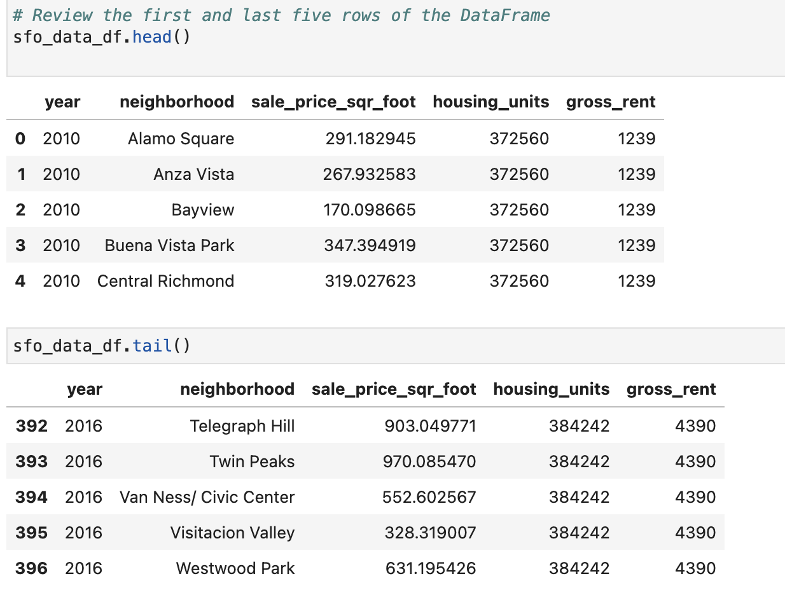
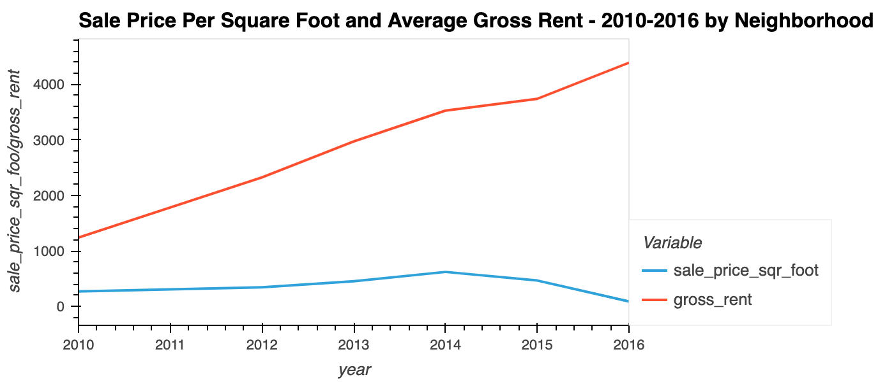
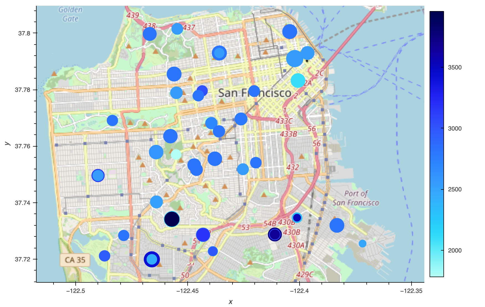

# Housing Rental Analysis for San Francisco

Using data visualization, including aggregation, interactive visualizations, and geospatial analysis, to find properties in the San Francisco market that are viable investment opportunities.

## Installation

To navigate through this data, you need to download and set up the following programs:

1-**python**
2- **pandas**`pip install pandas`
3- **jupyter lab** `pip install jupyter`
4- **hvPlot GeoViews**  `conda install -c pyviz hvplot geoviews`

## Important
*Import the required libraries and dependencies

- import pandas as pd
- import hvplot.pandas
- from pathlib import Path

## Usage
 
*Press the play button on Jupyter lab notebook, and you will be able to see all data and graphs associated with the analysis

## Contributing

Karim Bouzina [Linkedin](https://www.linkedin.com/feed/)

## License
Fintech UW edX Boot Camps
